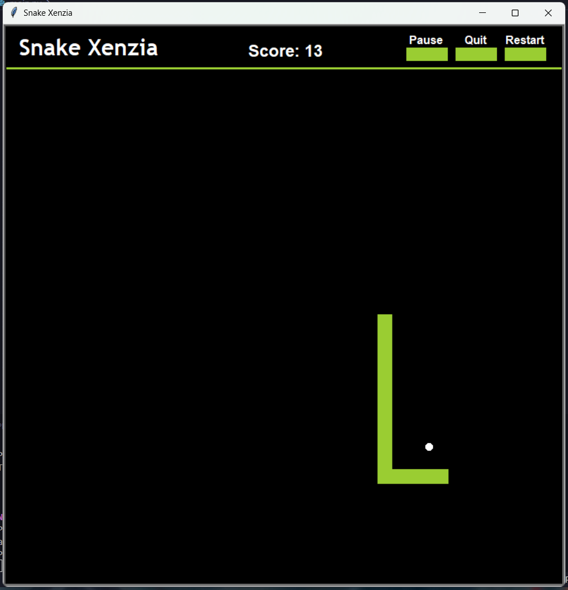

# Snake Xenzia (Python Turtle)

A classic Snake Xenzia game built using **Python** and **turtle graphics**, designed with a modular structure and interactive UI controls.

This project focuses not just on gameplay, but on **clean architecture, state management, and user interaction**.


## Features

* Classic Snake gameplay
* Pause / Resume functionality
* Restart game without restarting program
* Quit button
* Game state management (`running`, `paused`, `over`)
* Modular design (separate classes for `Snake`, `Food`, `Score`, `Menu`)
* Clickable UI buttons
* Dynamic difficulty (speed increases as snake grows)
* Collision detection:
  * Wall collision
  * Self collision
* Score tracking with live updates
* Clean UI with title, score, and game messages


## Project Structure

```
Snake-Xenzia/
│
├── main.py        # Main game loop and orchestration
├── snake.py       # Snake logic (movement, growth, collision)
├── food.py        # Food spawning and refresh logic
├── score.py       # Score display, pause, game-over UI
├── menu.py        # Button UI and interaction system
└── README.md
```


## Concepts Used

This project demonstrates key programming and software design concepts:

* Object-Oriented Programming (OOP)
* Event-driven programming
* State management
* UI layering using turtle graphics
* Game loop architecture
* Collision detection logic


## Controls

```
+---------------+-------+
| Action        |  Key  | 
+---------------+-------|
| Move Up       |   ↑   |
| Move Down     |   ↓   |
| Move Left     |   ←   |
| Move Right    |   →   |
+---------------+-------+
```

### Mouse:

Click buttons to `Pause` / `Restart` / `Quit`


## How to Run

### 1. Clone the repository

```bash
git clone https://github.com/your-username/Snake-Xenzia.git
```

### 2. Navigate into the folder:

cd Snake-Xenzia

### 3. Run the game:

python main.py


## Preview




## Game States

The game operates using a state-driven approach:

```
* `running`  --→  Normal gameplay
* `paused`   --→  Game is frozen
* `over`     --→  Game over screen
```


##  Design Highlights

* **Separation of concerns**:

  * Logic, UI, and control are handled in different modules
* **Reusable UI components**:

  * Button system with dynamic text updates
* **Independent UI layers**:

  * Score, pause message, and game over message use separate turtles
* **Smooth restart system**:

  * Game resets without restarting the program


## 🧑‍💻 Author

Built by **Shroojan Dhok**

---

## If you like this project

## Give it a ⭐ on GitHub — it helps a lot!
